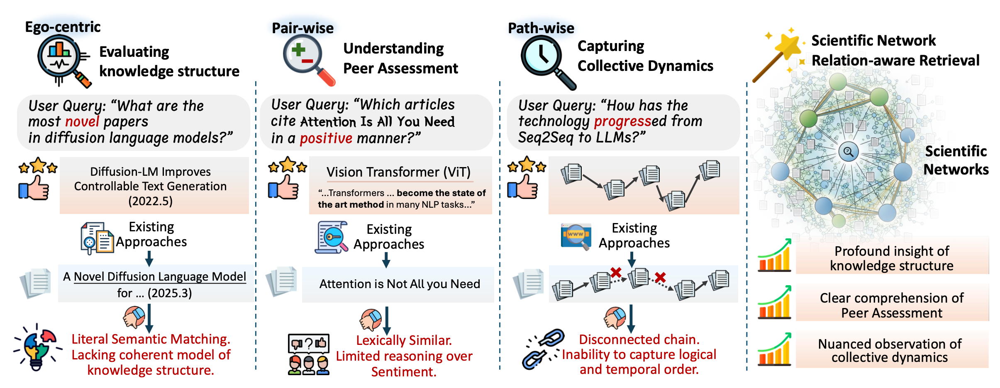

# SciNetBench: A Relation-Aware Benchmark for Scientific Literature Retrieval Agents

This repository contains the official implementation and dataset for **SciNetBench** (A Relation-Aware Benchmark for Scientific Literature Retrieval Agents), the first benchmark designed to systematically evaluate the relational understanding of literature retrieval systems in the scientific domain.

---

## 🎯 Benchmark Tasks

RARE evaluates retrieval systems across three distinct, increasingly complex levels of relational retrieval:

### 1. Ego-centric Relation: Evaluating Knowledge Structure Through Scientometric Insights 
- Use scientometric metrics to quantify the knowledge structure of papers
- Locating papers supported or contradicted by subsequent research  
- "Which is the most novel paper in diffusion language models?"

### 2. Pair-wise Relation: Understanding Peer Assessment through Citation Contexts
- Assessing peer evaluation attitudes toward a work based on citation context

- Sentiment-oriented queries: “Which papers cite Paper X positively?”
- Context-based co-mention queries: "Which papers are frequently mentioned together with Paper X within the same paragraph?"

### 3. Path-wise Relation: Capturing Collective Dynamics of Scientific Evolution
- Tracing a coherent chain of papers representing a scientific lineage  
- Mapping debates and idea evolution over time
- “What are the key milestones linking the seminal Transformer paper to today’s large language models?”

---

## 📊 Dataset

- Built upon a corpus of **18M+ AI-related papers**  
- Includes curated queries, ground-truth documents, and relational metadata  
- Supports evaluation of all three benchmark tasks  

We are committed to making SciNetBench accessible to the research community to foster innovation in this critical area.

---

## 🚀 Getting Started

### Folder hierarchy

The `queries` folder contains all queries used in the benchmark, including

- **Ego-Centric Relation**: queries_task1_disruptive.json, queries_task1_novel.json
- **Pair-Wise Relation**: queries_task2_comention.json , queries_task2_sentiment.json
- **Path-Wise Relation**: queries_task3_paths.json

The `Evaluation` folder contains the evaluation scripts for each benchmark:

- **Ego-Centric Relation**: 
  - **Novelty**:  task1-novelty-sos.py, task1-novelty-recall.py, task1-novelty-llm.py, task1-novelty-rank.py 
  - **Disruption**: task1-disruptive-sos.py, task1-disruptive-recall.py, task1-disruptive-llm.py, task1-disruption-rank.py 
- **Pair-Wise Relation**: 
  - **Sentiment**: task2-sentiment-cite-acc.py, task2-sentiment-context-acc.py 
  - **Convention**: task2-comention-acc.py, task2-comention-context-acc.py
- **Path-Wise Relation**: 
  - **Path**: task3-path-connectivity.py, task3-path-llm.py

> We are currently optimizing the evaluation scripts, and in the future, we will support automated scripts that enable one-click evaluation of all tasks across all metrics.

### 📄 License

This project is licensed under the MIT License.